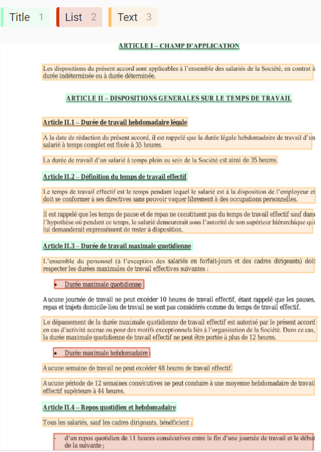
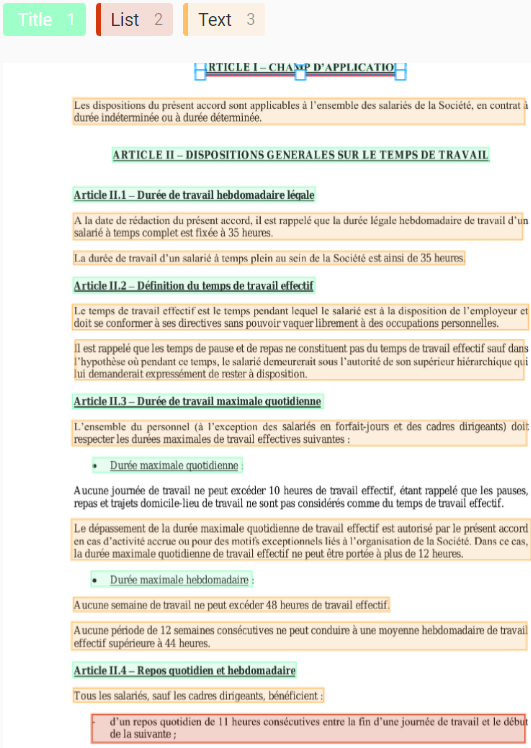
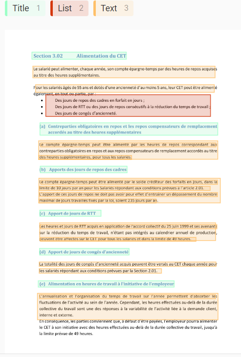

# Accords En Bref

Expérimentation pour résumer un accord, extraire un sommaire, voire d'extraire d'autres informations pertinentes

## Contexte

A l'issue des négociations professionnelles entre acteurs de l'entreprise, un accord est rédigé résumant toutes les décisions spéficiques prises pour l'entreprise, puis déposé sur la [télé-plateforme](https://www.teleaccords.travail-emploi.gouv.fr/PortailTeleprocedures/)
Ces accords contiennent une mine d'or d'informations et permettent de mieux saisir le tissu économique en constante évolution (nombre de jour de télétravail autorisé, etc.).
Ces accords sont publiés sous divers formats, document word, pdf scanné ou pdf numérique, et rend difficile l'exploitation statistique automatique.
Par ailleurs, les accords sont catégorisés lors du dépôt et traités par les DIRECCTE pour enrichir les métadonnées.

## Besoin

Tout d'abord, un premier besoin est de pouvoir extraire un sommaire et produire un résumé de l'accord, quel que soit le format et la structure de l'accord.
Ensuite, un deuxième besoin est de pouvoir effectuer une recherche par mot clé, voire de compléter les métadonnées
Enfin, un troisième besoin est d'extraire certaines informations pertinentes (nombre de jour de télétravail accordé)

## Solution technique

En python :
* OCR : tesseract + pytesseract
* Lecture des pdfs : Pypdf2
* transformers pour la production d'un résumé

## Labelisation

